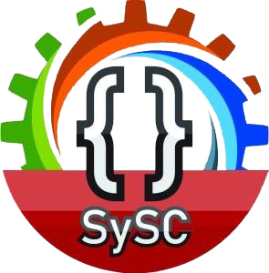

# Trabajos Universitarios

    

Esta es un repositorio donde estarán los códigos fuentes de los trabajos de la universidad para algunos videos y trabajos que lleguen a solicitar.

## Universidad

    

Universidad Interamericana para el Desarrollo **(UNID)**

Ciclo escolar sep. 2019 - dic. 2020 (No graduado, 4to concluido)

Carrera: Licenciatura en Ingeniería en Software y Sistemas Computacionales.

## Materias (Cuatrimestres)

-   Algoritmos **(2do)**
-   Principios de Programación Lógica **(3ro)**
-   Programación Visual **(4to)**
-   Programación Estructurada **(5to)**
