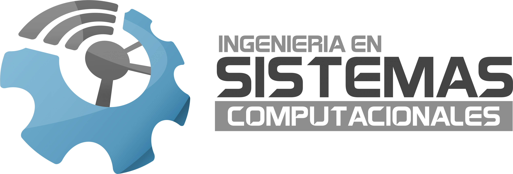

# Trabajos Universitarios

    

Esta es un repositorio donde estarán los códigos fuentes de los trabajos de la universidad para algunos videos y trabajos que lleguen a solicitar.

## Universidad

    

Tecnológico de Estudios Superiores de Chalco **(TESCHA)**

Ciclo escolar sep. 2021 - Actualidad (pronóstico: ene. 2026)

Carrera: Ingeniería en Sistemas Computacionales

## Materias - (Semestres)

- Fundamentos de Ingeniería de Software **(5to)**
